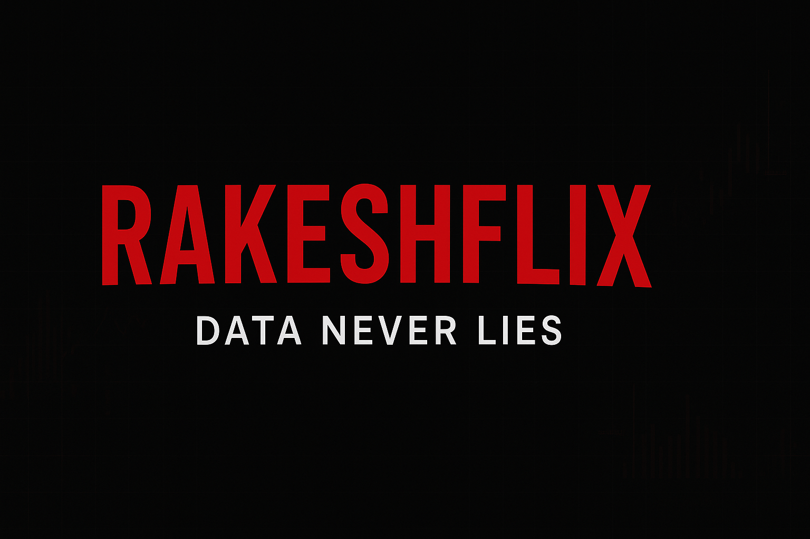

<!-- 🎬 Rakesh Nayak | Netflix-Themed GitHub Profile -->

<!-- Banner -->

  <h1 style="color:#E50914;">RakeshFlix</h1>
  <h3>“Simple difference between Me and My EX, One can manipulate people well and the other can do the same with Data. Well I am that other one if you are still confused.” 🍿</h3>

---

### 🎞️ **Now Streaming: Top Data Projects**
| Poster | Title | Description |
|:--:|:--|:--|
| 📦 | [**Mondelez Sales and Inventory Analysis**](https://github.com/RNayakDataHub/Mondelez-Sales-and-Inventory-Analysis) | SQL + Power BI analysis for improving inventory forecasting and sales insights. |
| 🛒 | [**Amazon Sales Analysis**](https://github.com/RNayakDataHub/Amazon_Sales) | Deep dive into sales data trends and customer behavior using Python (Pandas, Matplotlib, Seaborn). |
| 🧾 | [**Infonative Task – Reporting Effort Data**](https://github.com/RNayakDataHub/Infonative-Task-for-reporting-Effort-Data-) | Power BI dashboard creation and automation for business reporting efficiency. |
| 🚢 | [**Titanic Quick EDA**](https://github.com/RNayakDataHub/TitanicQuickEDA) | Exploratory data analysis on Titanic dataset — survival patterns and key insights. |
| 🧬 | [**Taxonomy Task – Axion Ray**](https://github.com/RNayakDataHub/Taxonomy-task-by-Axion-Ray) | Text data classification and cleaning using structured taxonomy sheets. |

---

### 🍿 **Currently Watching (Learning & Building)**
- 🧠 Machine Learning & AI Fundamentals  
- 🧩 Deep Learning (coming soon)  
- 💾 Live Database Projects  
- 🪄 Automating Dashboards with Power BI  

---

### ❤️ **Favorite Genres (Skills & Tools)**
`SQL` | `Python` | `Power BI` | `Tableau` | `Advanced Excel` | `Machine Learning` | `Data Cleaning` | `EDA` | `Visualization`

---

### 🔥 **Top Rated Data Skills**

---

### 🎬 **Behind The Scenes**
👋 Hi, I’m **Rakesh Nayak**, a passionate **Data Analyst** who loves turning messy data into clean, actionable stories.  
I specialize in **data analysis, visualization, and automation**, using tools like SQL, Python, Power BI, and ML.

> *Every dataset has a story — I just direct the scene.*

---

### 📈 **RakeshFlix Stats**

---

  <i>🎧 “Sit back, grab your popcorn, and let the data unfold.”</i>  
    
  

